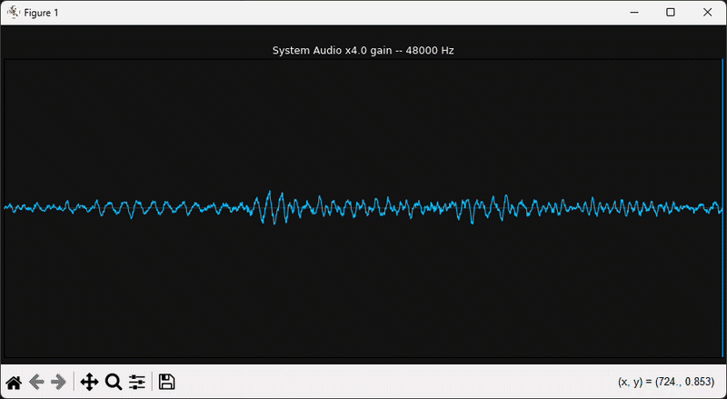
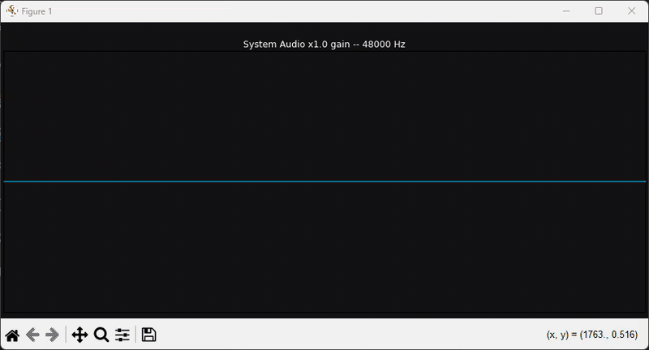
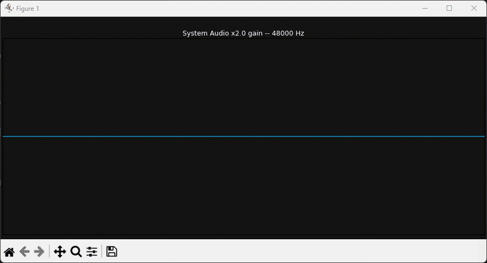
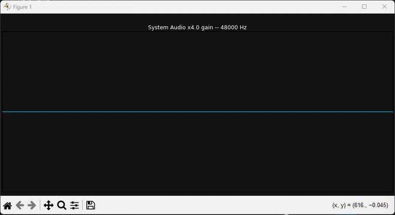
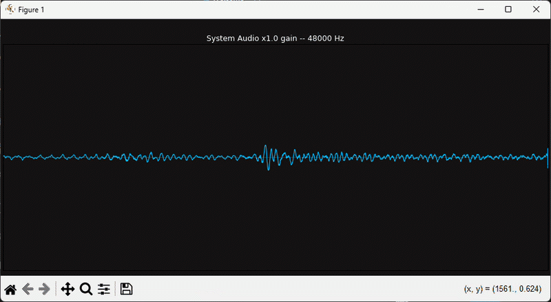

# DSP Artificial Sound Booster

Bridging together digital signal processing, code, and my pastime hobby of playing music in my dorm.

This project was inspired by coursework in **Linear Systems (EE23)** at Tufts University (Spring 2026). It uses Python to capture system audio via WASAPI loopback, amplify the signal using customizable gain thresholds, and route it to your physical computer speakers -- while visualizing the real-time waveform.



## Features
* **WASAPI Loopback Capture:** Grabs audio directly from the Windows system pipeline before it reaches the hardware.
* **Real-time Amplification:** Boosts audio output globally across your machine.
* **Live Matplotlib Visualization:** Renders a fast, lightweight real-time waveform of your current audio stream. 

## How to Use

### 1. Requirements
You will need Python installed along with the following libraries:
```bash
pip install pyaudiowpatch sounddevice numpy matplotlib
```

### 2. Setting Up Virtual Audio Cable
To intercept and amplify system audio without generating an infinite feedback loop, you must use a virtual audio cable.

1. Download VB-Cable from the official website.
2. Extract the zip file and run the installer as an Administrator.
3. Restart your computer.
4. Open your Windows Sound settings and set your default output device to CABLE Input.

### 3. Running the Script
1. git clone this repository or copy the code into a Python file (e.g., `audio_booster.py`):
        ```
        git clone https://github.com/jesse-flores/-DSP-Artificial-Sound-Booster.git
        ```

2. Run the script command to find the correct audio device index for your system:
        ```
        python audio_booster.py -l
        ```

This will print two lists: your PyAudio WASAPI Input devices, and your SoundDevice Output devices.

Find the index number for CABLE Input in the input list, and the index number for your Real Speakers/Headphones in the output list.

3. Run the booster using those specific indices:
        ```
        python audio_booster.py -s [Cable_Index] -o [Computer_Speaker_Index]
        ```

### 4. Adjusting Gain
You can adjust the gain used in the feedback loop by adding the flag '-g' followed by a float value. For example, to set the gain to 2.0:
```bash
python audio_booster.py -s [Cable_Index] -o [Computer_Speaker_Index] -g 2.0
```

## Example Usage
While gain can easily introduce overwhelming clipping and distortion, it can also be used creatively to enhance certain audio characteristics. For instance, setting a gain of 1.5 can make quiet passages more audible without overwhelming louder sections.

An example of the terrible sounds and distortion that can occur with the wrong gain settings is easily seen when running a simple sine wave.

You do not want to hear what these resulted in; test at your own risk...



Original sine wave with no gain.



Sine wave with a gain of 2.0, possibly showing minor clipping and distortion.



Sine wave with a gain of 4.0, possibly showing severe clipping and distortion.

However, usecase matters. For some music genres, a bit of distortion can add character and warmth to the sound. Experimenting with different gain settings can help you find the sweet spot for your audio preferences.

Here's an example of the same gain settings applied to a music track:



Josiah Queen's 'Judas' with no gain.


Josiah Queen's 'Judas' with a gain of 4.0 sounded so much better for my system.

Give it a listen:
* Josiah Queen - 'Judas' (https://www.youtube.com/watch?v=bzbH9pTz_rI)

## Possible Troubleshooting
* For script-running troubleshooting, ensure you have the correct audio device indices and that your virtual audio cable is properly set up and run 'python audio_booster.py -help' for more options.
* If you experience audio feedback or a loud screeching noise, immediately stop the script and check your gain settings. Start with a lower gain (e.g., 1.5) and gradually increase it while monitoring the output.
* If the real-time visualization is lagging or not displaying correctly, ensure you have the latest version of Matplotlib installed and that your system meets the necessary performance requirements.

## License
This project is licensed under the MIT License - see the [LICENSE](LICENSE) file for details.